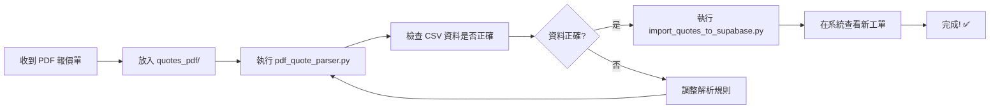

# 🚀 PDF 報價單快速匯入系統 - 完整流程

## 📋 概述

這個工具讓您可以**3步驟**將 PDF 報價單快速建立到系統內：

```
PDF 報價單 → 自動提取欄位 → 匯入 Supabase → 完成! ✅
```

---

## 🎯 快速開始

### 步驟 1: 安裝依賴套件

```powershell
# 必要套件
pip install pdfplumber pandas openpyxl supabase

# 驗證安裝
python test_pdf_parser.py
```

### 步驟 2: 放入 PDF 報價單

將您的 PDF 報價單檔案放入 `quotes_pdf` 資料夾

```
quotes_pdf/
  ├── 校驗報價單_F26001.pdf
  ├── 報價單_F26002.pdf
  └── ...
```

### 步驟 3: 執行解析

```powershell
# 解析 PDF 並提取欄位
python pdf_quote_parser.py
```

這會生成:
- `quotes_parsed/校驗報價單_F26001.csv` - 可用 Excel 查看
- `quotes_parsed/校驗報價單_F26001.json` - 結構化資料

### 步驟 4: 匯入資料庫

```powershell
# 將解析後的資料匯入 Supabase
python import_quotes_to_supabase.py
```

**完成!** 🎉 您的報價單已經建立到系統內了。

---

## 📊 實際範例

### 輸入: PDF 報價單

```
校驗報價單
報價單號: F-26001
客戶: 財團法人工業技術研究院
報價日期: 114年1月19日

項目  品名                          數量  單價    總價
A.    白金電阻溫度計 (20-60℃)      28    $5,000  $140,000
B.    白金電阻溫度計 (0-80℃)       4     $6,500  $26,000
C.    白金電阻溫度計 (0-90℃)       1     $7,000  $7,000
                                              NT$173,000
```

### 輸出 1: CSV 檔案 (`quotes_parsed/校驗報價單_F26001.csv`)

| 報價單號 | 客戶名稱 | 報價日期 | 項目編號 | 產品名稱 | 規格 | 數量 | 單價 | 總價 |
|---------|---------|---------|---------|----------|-----|------|------|------|
| F-26001 | 財團法人工業技術研究院 | 114年1月19日 | A | 白金電阻溫度計 | 校正點20-60℃ | 28 | 5000 | 140000 |
| F-26001 | 財團法人工業技術研究院 | 114年1月19日 | B | 白金電阻溫度計 | 校正點0-80℃ | 4 | 6500 | 26000 |
| F-26001 | 財團法人工業技術研究院 | 114年1月19日 | C | 白金電阻溫度計 | 校正點0-90℃ | 1 | 7000 | 7000 |

### 輸出 2: Supabase 訂單

系統會自動建立:

- **訂單編號**: `F-26001`
- **客戶**: `財團法人工業技術研究院` (自動新增到客戶列表)
- **設備案號**: `EQ-F26001`
- **設備名稱**: `白金電阻溫度計`
- **明細**: 3 筆校正項目
- **狀態**: `Pending` (待處理)

---

## 🔧 進階功能

### 自訂訂單編號規則

編輯 `import_quotes_to_supabase.py`:

```python
# 第 53 行
order_number = f"CAL-{year}-{original_quote_no.replace('-', '')}"

# 改為您的規則，例如:
order_number = f"CHUYI-{original_quote_no}"  # CHUYI-F26001
```

### 批次處理多個 PDF

只需將所有 PDF 放入 `quotes_pdf` 資料夾，工具會自動處理全部:

```powershell
python pdf_quote_parser.py           # 解析全部
python import_quotes_to_supabase.py  # 匯入全部
```

### 匯出為 Excel 而非 CSV

修改 `pdf_quote_parser.py` 第 273 行:

```python
# 原本:
df.to_csv(output_path, index=False, encoding='utf-8-sig')

# 改為:
df.to_excel(output_path.replace('.csv', '.xlsx'), index=False)
```

---

## ⚠️ 常見問題

### Q1: 提取的欄位不準確

**情況 A: PDF 是掃描圖片**

需要安裝 OCR:

```powershell
# 安裝 Tesseract OCR
# 下載: https://github.com/UB-Mannheim/tesseract/wiki
# 安裝到: C:\Program Files\Tesseract-OCR\

pip install pytesseract pillow
```

**情況 B: 報價單格式特殊**

可以手動調整解析規則，或將 PDF 樣本提供給我進一步優化程式。

### Q2: 匯入時顯示「欄位不符」

檢查 `database_schema.sql` 確保資料表結構正確:

```sql
-- 確認必要欄位存在
SELECT column_name 
FROM information_schema.columns 
WHERE table_name = 'cali_orders';
```

### Q3: 如何跳過已匯入的檔案?

執行匯入後,選擇歸檔:

```
是否將已匯入的檔案移到 quotes_archived 資料夾? (y/N): y
```

已處理的檔案會自動移除，避免重複匯入。

### Q4: 可以用在其他類型的報價單嗎?

可以! 只需調整 `pdf_quote_parser.py` 中的正則表達式:

```python
self.patterns = {
    'quote_number': r'您的報價單號格式',
    'customer': r'您的客戶欄位格式',
    # ...
}
```

---

## 📁 檔案結構

```
08_CHUYI_CALIBRATION/
├── pdf_quote_parser.py           # PDF 解析主程式
├── import_quotes_to_supabase.py  # 資料庫匯入工具
├── test_pdf_parser.py            # 環境測試腳本
├── PDF_PARSER_README.md          # 詳細技術文件
├── QUICK_START.md                # 本檔案
│
├── quotes_pdf/                   # 📥 放入 PDF 報價單
│   └── 校驗報價單_P26001.pdf
│
├── quotes_parsed/                # 📤 解析後的資料
│   ├── 校驗報價單_F26001.csv
│   └── 校驗報價單_F26001.json
│
└── quotes_archived/              # 📦 已匯入的檔案 (可選)
    └── ...
```

---

## 🎓 完整工作流程



---

## 💡 最佳實踐

1. **先測試小批次**: 先處理 1-2 個 PDF 確認結果正確
2. **備份原始檔案**: 保留 PDF 原檔以備查
3. **檢查提取資料**: 匯入前先用 Excel 開啟 CSV 檢查
4. **定期歸檔**: 處理完的檔案移到 `quotes_archived`
5. **建立命名規範**: PDF 檔名使用統一格式(例: `報價單_F26001.pdf`)

---

## 🆘 需要幫助?

如果遇到問題:

1. 執行測試腳本: `python test_pdf_parser.py`
2. 查看詳細文件: `PDF_PARSER_README.md`
3. 檢查錯誤訊息並提供完整輸出
4. 提供 PDF 樣本 (可遮蔽敏感資訊)

---

**製作:** 制宜電測校正系統  
**最後更新:** 2026-01-12
